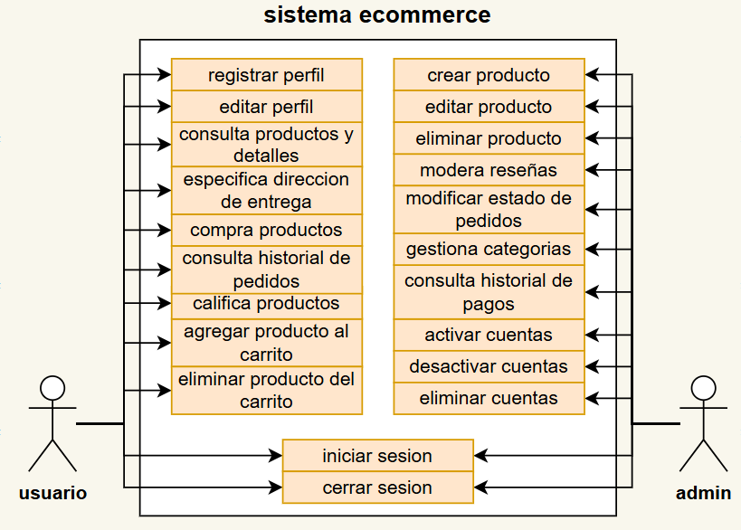
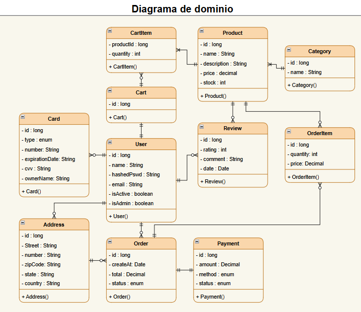
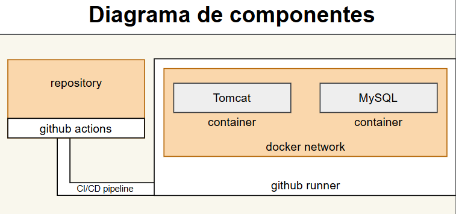

<!--  -->

# Proyecto de aplicaciones web ecommerce con Java Tomcat

Proximamente disponible en <a href="https://ecommerce.erwbyel.org"> https://ecommerce.erwbyel.org </a> 

<h3>Integrantes</h3>
<ul>
  <li>Angel Erubiel Flores Jimenez - 00000252389</li>
  <li>Luis Fernando Bautista Luna - 00000252081</li>
  <li>Roberto Verdugo Beltran - 00000248285</li>
  <li>Luis Enrique Valenzuela Chavez - 00000253255</li>
</ul>

<h2> Diagrama de Casos de Uso</h2>

<h2> Diagrama de Clases Dominio</h2>

<h2> Diagrama de Componentes</h2>

